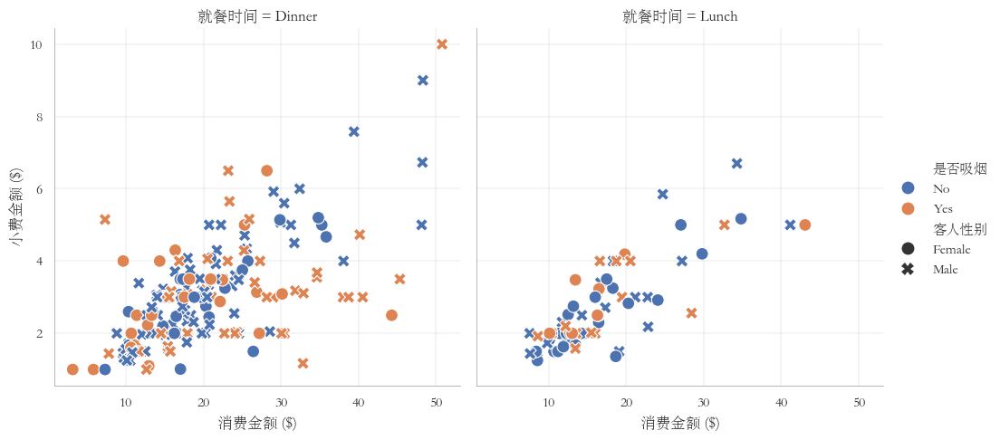
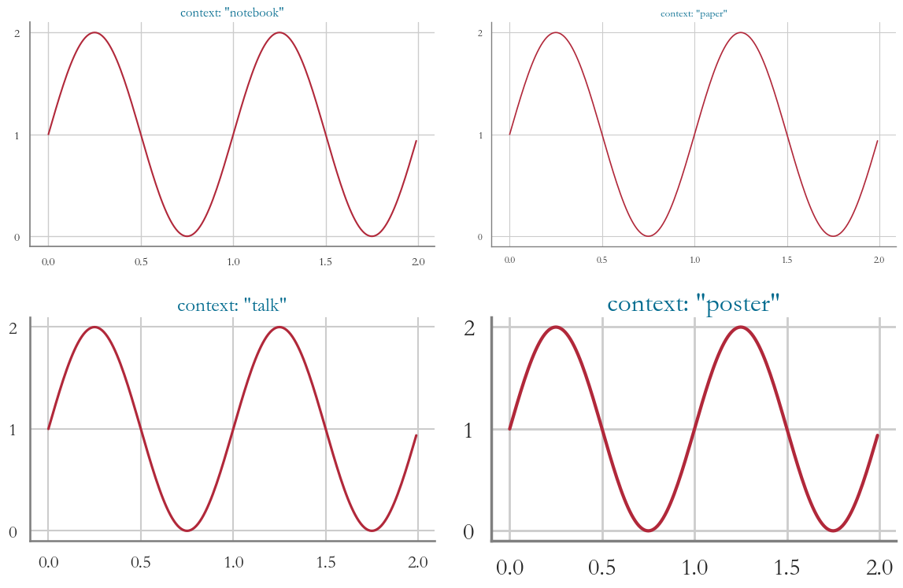
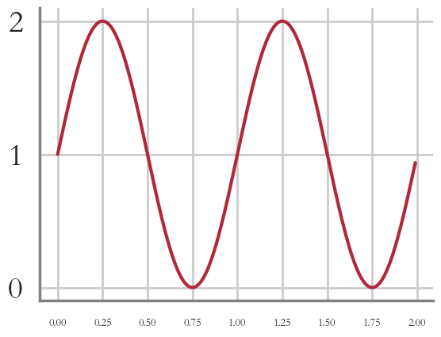
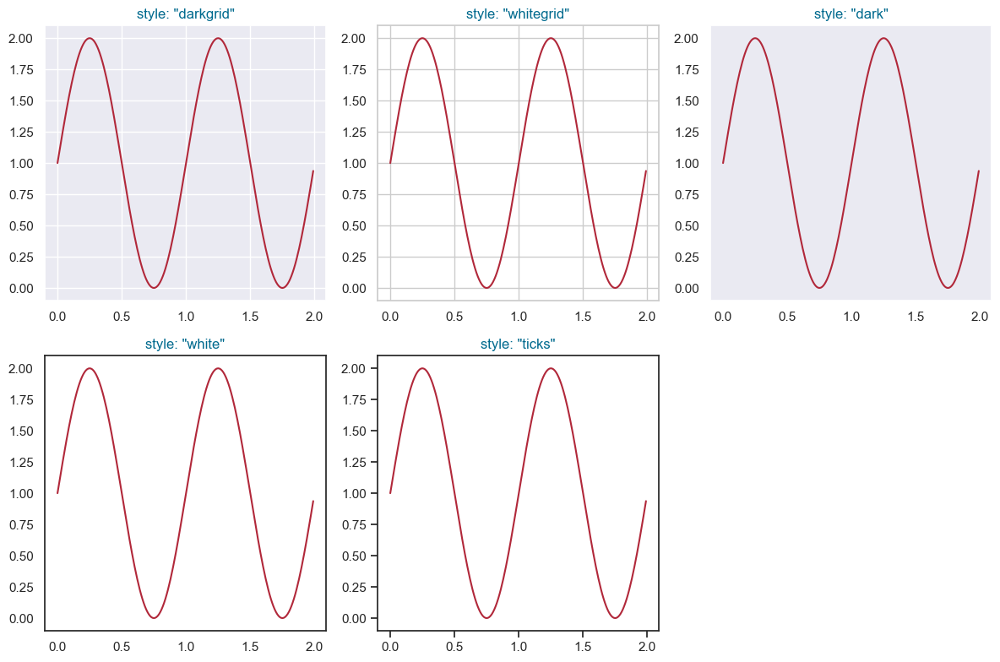
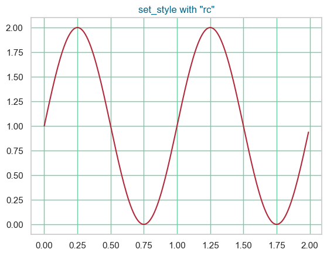
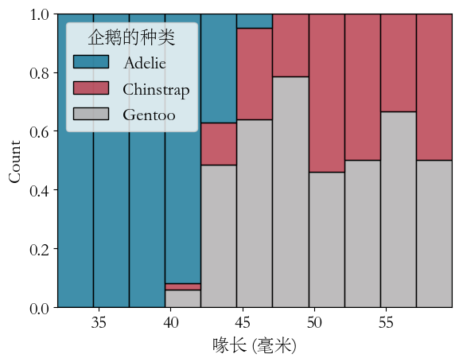
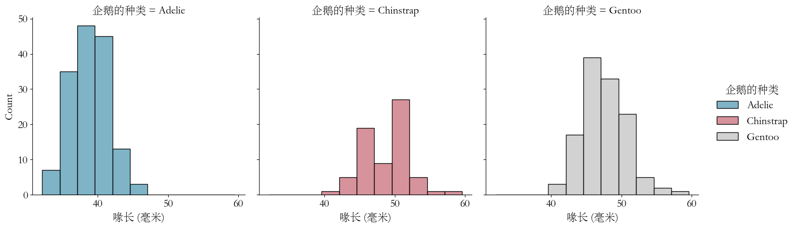
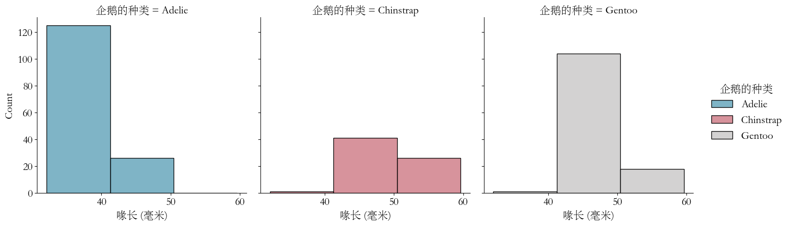
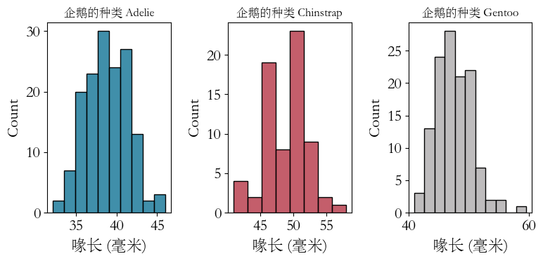
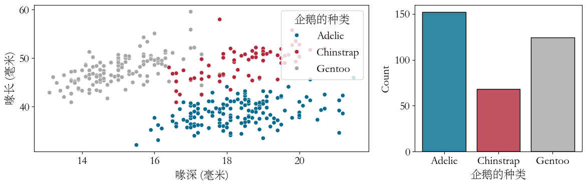

```python
import pandas as pd
import numpy as np
import matplotlib
import matplotlib.pyplot as plt
import sys
print('Python version:', sys.version)
print('Pandas version:', pd.__version__)
print('Numpy version:', np.__version__)
print('Matplotlib version:', matplotlib.__version__)
```

    Python version: 3.12.3 | packaged by conda-forge | (main, Apr 15 2024, 18:20:11) [MSC v.1938 64 bit (AMD64)]
    Pandas version: 2.2.2
    Numpy version: 1.26.4
    Matplotlib version: 3.8.4
    


```python
import seaborn as sns
sns.__version__
```


    '0.13.2'


seaborn通过各种函数可视化数据，以seaborn.relplot函数绘制相关关系图为例， 


```python
#第1步：导入依赖包
import seaborn as sns  # 导入seaborn包并简写为sns
import pandas as pd  # 导入数据准备包pandas并简写为pd
import matplotlib as mpl
import warnings

#ignore warnings​
warnings.filterwarnings("ignore", "is_categorical_dtype")
warnings.filterwarnings("ignore", "use_inf_as_na")
warnings.simplefilter('always', category=UserWarning)
plt.rcParams['axes.unicode_minus'] = False

#第2步：设置绘图风格
plt.rcParams['axes.unicode_minus'] = False
custom_set = {
    "font.family": "STsong",
    "axes.spines.left": True,  #y坐标轴开启
    "axes.spines.bottom": True,  #x坐标轴开启
    "axes.spines.top": False,  #上方坐标轴关闭
    "axes.spines.right": False,  #右侧坐标轴关闭
    "axes.edgecolor": "gray",  #坐标轴颜色
    "axes.linewidth": 0.4,  #坐标轴宽度
    "grid.linewidth": 0.3,  #网格线宽度
    "grid.alpha": 1,  #网格线透明度
    "legend.frameon": True,  #图例边框开启
    "legend.framealpha": 0.5  ##图例边框透明度
}

sns.set_theme(
    style='whitegrid',  #设置图表的风格为“whitegrid”
    rc=custom_set,  #坐标轴、图例、网格线等其它设置
    font_scale=1,  #文本字号
)

#第3步：准备绘图数据
tips = pd.read_csv('./sns_data/tips.csv')  #使用pandas读取数据

#第4步：seaborn绘图
## 一行代码绘图，为了便于介绍，以下将代码分行
sns.relplot(  #使用seaborn.relplot函数制作相关关系图
    data=tips,  #指定绘图数据tips​
    x="消费金额 ($)",  #(1) 指定x轴变量"消费金额 ($)"
    y="小费金额 ($)",  #(2) 指定y轴变量"小费金额 ($)"
    col="就餐时间",  #(3) 设置通过"就餐时间"种类，按照列分面（facets）绘图
    hue="是否吸烟",  #(4) 设置散点颜色按照"是否吸烟"种类变化
    style="客人性别",  #(5) 设置散点形状按照"是客人性别"变化
    s=100  #设置点大小
)
plt.show()
```


    

    


- 可视化流程概览
  - 步骤一：引入必要的库
    - 首先，需要导入seaborn库，并通常使用别名sns来简化后续代码。
  - 步骤二：定义图表样式
    - 接着，选择合适的绘图风格，如“whitegrid”，以个性化图表的外观，包括坐标轴、图例和网格线等。
  - 步骤三：数据准备
    - 然后，根据数据集的格式准备绘图所需的数据。seaborn支持多种数据格式，示例中使用pandas的pd.read_csv函数来加载数据。
  - 步骤四：选择绘图函数
    - 最后，根据可视化目标选择合适的seaborn绘图函数。本例中，为了展示“消费金额”与“小费金额”之间的相关性，以及“就餐时间”、“是否吸烟”、“客人性别”等因素对这种关系的影响，选用了seaborn中的seaborn.relplot函数来展示统计关系。
  - 后续内容
    - 接下来的部分将深入探讨seaborn的主要绘图函数及其应用。


Seaborn 的绘图函数可以分为两大类，以及多个子类别，每个类别都有其特定的用途和功能。以下是详细的分类和描述：

1. **美化函数（Aesthetics）**：
   - **图形比例尺度（Scaling of plot elements）**：调整图形元素的大小和比例，以适应不同的显示需求。
   - **图形风格（General style of the plots）**：通过设置不同的风格，如 `darkgrid`、`whitegrid` 等，来改变图形的整体外观。
   - **图形配色（Color palette/colormap）**：使用不同的颜色方案，如 `deep`、`muted`、`pastel` 等，来增强图形的视觉效果。

2. **单个图函数（Individual plot functions）**：
   - **关系图（Relational plots）**：例如 `sns.relplot()`，用于展示两个变量之间的关系，如散点图、线图等。
   - **分布图（Distribution plots）**：例如 `sns.histplot()` 和 `sns.kdeplot()`，用于展示数据的分布情况，包括直方图和核密度估计。
   - **分类图（Categorical plots）**：例如 `sns.catplot()`，用于展示分类数据的分布和关系，支持在不同的子图中展示数据。
   - **回归图（Regression plots）**：例如 `sns.regplot()` 和 `sns.lmplot()`，用于展示变量之间的回归关系。
   - **矩阵图（Matrix plots）**：例如 `sns.heatmap()`，用于展示矩阵数据，通常用于展示相关性矩阵。
   - **统计估计和误差棒（Statistical estimation and error bars）**：例如 `sns.barplot()` 和 `sns.pointplot()`，用于展示统计估计的准确性和误差范围。

3. **组合图函数（Composite plot functions）**：
   - **分面图（Facet grids）**：例如 `sns.FacetGrid()`，允许用户在一个图形中创建多个子图，每个子图展示数据的一个子集。
   - **配对图（Pair grids）**：例如 `sns.PairGrid()`，用于展示数据集中每对变量之间的关系。
   - **组合图（Joint grids）**：例如 `sns.JointGrid()`，用于同时展示多个图形，以展示更复杂的数据关系。

Seaborn 的设计目标是简化统计数据可视化的过程，提供高级接口和美观的默认主题，使得用户能够通过少量的代码实现复杂的图形。Seaborn 在设计时注重美观性，其默认主题和颜色调色板经过精心选择，使得绘图更加吸引人。Seaborn 可以很好地与 NumPy 和 Pandas 数据结构配合使用，它带有用于样式化 Matplotlib 图形的内置主题，使得用户能够更轻松地创建美观且具有一致性的图形。

更多关于 Seaborn 的详细信息和教程，可以参考 Seaborn 官方文档。

## 图表美化context的使用

在 Seaborn 中，`context` 用于设置图形的比例尺度，它影响图形的整体布局和元素的相对大小。`context` 可以设置为不同的上下文，以适应不同的展示需求，比如报告、演讲或者网页展示。

以下是如何查看和设置 `context` 的步骤：

1. **查看当前的 context 内容**：
   - 要查看当前图形的 context 内容，可以使用 `sns.plotting_context()` 函数。这个函数没有参数，它会返回当前的 context 设置。

   ```python
   import seaborn as sns
   current_context = sns.plotting_context()
   print(current_context)
   ```

2. **设置 context**：
   - 可以通过 `sns.set_context()` 函数来设置 context。这个函数接受一个上下文名称作为参数，如 `"notebook"`、`"talk"`、`"paper"` 或 `"poster"`。

   ```python
   sns.set_context("talk")
   ```

   - `sns.set_context()` 函数还可以接受额外的参数来微调图形的大小和字体大小。例如，可以设置 `rc` 参数来调整 Matplotlib 的配置参数。

   ```python
   sns.set_context("talk", rc={"lines.linewidth": 2.5})
   ```


### 查看当前的 context 内容


```python
# sns.plotting_context()
```

    {
        'font.size': 12.0,             # 字体大小
        'axes.labelsize': 12.0,        # 坐标轴标签大小
        'axes.titlesize': 12.0,        # 坐标轴标题大小
        'xtick.labelsize': 11.0,       # x轴刻度标签大小
        'ytick.labelsize': 11.0,       # y轴刻度标签大小
        'legend.fontsize': 11.0,       # 图例字体大小
        'legend.title_fontsize': 12.0, # 图例标题字体大小
        'axes.linewidth': 1.25,        # 坐标轴线宽度
        'grid.linewidth': 1.0,         # 网格线宽度
        'lines.linewidth': 1.5,        # 线条宽度
        'lines.markersize': 6.0,       # 线条标记大小
        'patch.linewidth': 1.0,        # 图形patch线宽度
        'xtick.major.width': 1.25,     # x轴主刻度线宽度
        'ytick.major.width': 1.25,     # y轴主刻度线宽度
        'xtick.minor.width': 1.0,      # x轴次刻度线宽度
        'ytick.minor.width': 1.0,      # y轴次刻度线宽度
        'xtick.major.size': 6.0,       # x轴主刻度线长度
        'ytick.major.size': 6.0,       # y轴主刻度线长度
        'xtick.minor.size': 4.0,       # x轴次刻度线长度
        'ytick.minor.size': 4.0        # y轴次刻度线长度
    }

### 设置 contex


```python
import seaborn as sns
import numpy as np
import matplotlib.pyplot as plt
plt.figure(figsize=(12, 8))
contexts = ['notebook', 'paper', 'talk', 'poster']
t = np.arange(0.0, 2.0, 0.01) # 生成 0-2 范围内，步长为 0.01 的点
s = 1 + np.sin(2 * np.pi * t) # 计算该点对应的值
for i, context in enumerate(contexts):
    sns.set_context(context)  #设置context
    plt.subplot(2, 2, i + 1)
    sns.lineplot(x=t, y=s, color="#b1283a")
    plt.title(f"context: \"{context}\"", color="#006a8e")
plt.tight_layout()
plt.show()
```


    

    


3. **常用的 context 选项**：
   - `"notebook"`：适用于 Jupyter 笔记本，优化了图形的大小和字体大小，使其在笔记本中显示得更清晰。
   - `"talk"`：适用于演讲或展示，通常具有较大的字体和较宽的图例，以便在远处观看。
   - `"paper"`：适用于学术出版物，提供了适合打印的高质量图形。
   - `"poster"`：适用于海报展示，通常具有更大的尺寸和更显眼的元素。

通过合理设置 `context`，可以确保图形在不同的展示环境中都能达到最佳的视觉效果。

上图可清晰的展示context变化，图形中字体、线宽等属性的变化。
在使用某款已经内置的context方案的同时，还可以通过rc单独设置其中的任意参数，


```python
t = np.arange(0.0, 2.0, 0.01) # 生成 0-2 范围内，步长为 0.01 的点
s = 1 + np.sin(2 * np.pi * t) # 计算该点对应的值

#痛过rc独立设置xtick.labelsize,#通过font_scale设置整个图的字体缩放
sns.set_context('poster', rc={"xtick.labelsize": 10},font_scale=1.3)
sns.lineplot(x=t, y=s, color="#b1283a")
plt.show()
```


    

    


## style样式设定

在 Seaborn 中，`style` 用于设置图形的通用样式，包括线条、颜色、背景等元素的外观。`style` 可以设置为不同的样式，以改变图形的整体外观和风格。

以下是如何查看和设置 `style` 的步骤：

1. **查看当前的 style 内容**：
   - 要查看当前图形的 style 内容，可以使用 `sns.axes_style()` 函数。这个函数没有参数，它会返回当前的 style 设置。

   ```python
   import seaborn as sns
   current_style = sns.axes_style()
   print(current_style)
   ```

2. **设置 style**：
   - 可以通过 `sns.set_style()` 函数来设置 style。这个函数接受一个样式名称作为参数，如 `"darkgrid"`、`"whitegrid"`、`"dark"`、`"white"` 和 `"ticks"`。

   ```python
   sns.set_style("darkgrid")
   ```

   - `sns.set_style()` 函数还可以接受额外的参数来微调图形的样式。例如，可以设置 `rc` 参数来调整 Matplotlib 的配置参数。

   ```python
   sns.set_style("white", {"xtick.major.size": 8, "ytick.major.size": 8})
   ```

3. **常用的 style 选项**：
   - `"darkgrid"`：黑色背景，带有网格线。
   - `"whitegrid"`：白色背景，带有网格线。
   - `"dark"`：黑色背景，没有网格线。
   - `"white"`：白色背景，没有网格线。
   - `"ticks"`：只有坐标轴上的刻度标记，没有网格线，背景透明。

通过合理设置 `style`，可以确保图形在不同的展示环境中都能达到最佳的视觉效果。以下是一个示例代码，展示如何查看和设置 `style`：

```python
import seaborn as sns
import matplotlib.pyplot as plt

# 查看当前的 style 内容
current_style = sns.axes_style()
print("Current style settings:", current_style)

# 设置 style 并绘制图形
sns.set_style("whitegrid")
plt.figure(figsize=(8, 6))
plt.plot([1, 2, 3, 4], [1, 4, 9, 16], color="blue")
plt.title("Example Plot with 'whitegrid' Style")
plt.show()
```

在这个代码中，我们首先查看了当前的 `style` 设置，然后设置了 `"whitegrid"` 样式，并绘制了一个简单的图形来展示这种样式的效果。


### 查看当前的 style 内容


```python
# sns.axes_style()
```

    {​
        'axes.facecolor': '#EAEAF2',                # 坐标轴背景颜色​
        'axes.edgecolor': 'white',                  # 坐标轴边框颜色​
        'axes.grid': True,                          # 是否显示网格线​
        'axes.axisbelow': True,                     # 网格线是否在图形下方​
        'axes.labelcolor': '.15',                   # 坐标轴标签颜色​
        'figure.facecolor': 'white',                # 图形背景颜色​
        'grid.color': 'white',                      # 网格线颜色​
        'grid.linestyle': '-',                      # 网格线样式​
        'text.color': '.15',                        # 文本颜色​
        'xtick.color': '.15',                       # x轴刻度颜色​
        'ytick.color': '.15',                       # y轴刻度颜色​
        'xtick.direction': 'out',                  # x轴刻度线方向​
        'ytick.direction': 'out',                  # y轴刻度线方向​
        'lines.solid_capstyle': 'round',           # 线条末端样式​
        'patch.edgecolor': 'w',                    # 图形patch边框颜色​
        'patch.force_edgecolor': True,             # 强制指定图形patch边框颜色​
        'image.cmap': 'rocket',                    # 图像的色彩映射​
        'font.family': ['sans-serif'],             # 字体家族​
        'font.sans-serif': ['Arial',               # 无衬线字体​
                            'DejaVu Sans',​
                            'Liberation Sans',​
                            'Bitstream Vera Sans',​
                            'sans-serif'],​
        'xtick.bottom': False,                     # x轴刻度是否显示在底部​
        'xtick.top': False,                        # x轴刻度是否显示在顶部​
        'ytick.left': False,                       # y轴刻度是否显示在左侧​
        'ytick.right': False,                      # y轴刻度是否显示在右侧​
        'axes.spines.left': True,                  # 左侧坐标轴边框是否显示​
        'axes.spines.bottom': True,                # 底部坐标轴边框是否显示​
        'axes.spines.right': True,                 # 右侧坐标轴边框是否显示​
        'axes.spines.top': True                    # 顶部坐标轴边框是否显示​
    }

可知，style中包含图形的样式和颜色等属性。


```python
import seaborn as sns
import matplotlib.pyplot as plt
plt.figure(figsize=(12, 8))
sns.set_theme()
styles = ['darkgrid', 'whitegrid', 'dark', 'white', 'ticks']
for i, style in enumerate(styles):
    sns.set_style(style)  #设置style
    plt.subplot(2, 3, i + 1)
    sns.lineplot(x=t, y=s, color="#b1283a")
    plt.title(f"style: \"{style}\"", color="#006a8e")
plt.tight_layout()
plt.show()
```


    

    


上图可清晰的展示随着style变化，图形中背景色、网格线等属性的变化。
在使用某款已经内置的style方案的同时，还可以通过rc独立设置某个参数，

### 设置 style


```python
# rc独立设置某个参数
import seaborn as sns
import matplotlib.pyplot as plt

#rc设置网格线的颜色为绿色​
sns.set_style('whitegrid', rc={'grid.color': '#6ccea3'}) 
sns.lineplot(x=t, y=s, color="#b1283a")
plt.title('set_style with \"rc\"', color="#006a8e")
plt.show()
```


    

    


## 交互式选色器

在 Seaborn 中，颜色调色板（color palettes）是非常重要的部分，它们可以用于改善数据可视化的美观性和可读性。调色板通常基于三种主要的数据类型：顺序（sequential）、发散（diverging）和定性（qualitative）。这些类型决定了如何选择和应用颜色。
### 顺序调色板
顺序调色板（Sequential color palettes）在数据可视化中非常有用，特别适合表示有自然顺序或等级的数据。这类调色板通常从浅色到深色进行渐变，帮助观众直观地理解数据的分布和趋势。以下是一些常见的使用场景和示例：

顺序调色板用于表示有顺序意义的数据，通常从低到高。颜色通常按照强度或亮度的变化进行排列。

常用的顺序调色板：Blues, BuGn, BuPu, GnBu, Greens, Greys, Oranges, OrRd, PuBu, PuBuGn, PuRd, Purples, RdPu, Reds, YlGn, YlGnBu, YlOrBr, YlOrRd

#### 使用场景
- 热力图（Heatmaps）:热力图是顺序调色板的经典应用场景之一，用于展示二维数据矩阵中的值。例如，展示不同月份和年份的乘客数量。

- 地图数据（Choropleth Maps）顺序调色板在地图上非常有用，尤其适合展示地区数据（如人口密度、收入水平等）。

- 条形图和柱状图（Bar Plots）顺序调色板适用于按特定顺序排列的数据条形图或柱状图，帮助突出数据的顺序关系。

#### 顺序调色板的演示


```python
import seaborn as sns
sns.choose_colorbrewer_palette(
    data_type='sequential',  #data_type有‘sequential’, ‘diverging’, ‘qualitative’三种可选​
    as_cmap=False)
```


    interactive(children=(Dropdown(description='name', options=('Greys', 'Reds', 'Greens', 'Blues', 'Oranges', 'Pu…


    [(0.9575547866205305, 0.9575547866205305, 0.9575547866205305),
     (0.9012072279892349, 0.9012072279892349, 0.9012072279892349),
     (0.8328950403690888, 0.8328950403690888, 0.8328950403690888),
     (0.7502191464821223, 0.7502191464821223, 0.7502191464821223),
     (0.6434140715109573, 0.6434140715109573, 0.6434140715109573),
     (0.5387158785082661, 0.5387158785082661, 0.5387158785082661),
     (0.440322952710496, 0.440322952710496, 0.440322952710496),
     (0.342883506343714, 0.342883506343714, 0.342883506343714),
     (0.22329873125720878, 0.22329873125720878, 0.22329873125720878),
     (0.10469819300269129, 0.10469819300269129, 0.10469819300269129)]


### 发散（Diverging）调色板
发散调色板用于展示数据的两端偏离某个中心点的情况。它们非常适合用于需要突出正负变化、对称性或差异的数据展示。通常，这些调色板在中心位置颜色较浅，向两端颜色逐渐加深，以便观众可以直观地看到数据的偏差。

以下是一些常用的发散调色板及其特点：BrBG, PiYG, PRGn, PuOr, RdBu, RdGy, RdYlBu, RdYlGn, Spectral

#### 使用场景

发散调色板（Diverging color palettes）非常适合用于展示数据两端的变化，尤其当数据集中有一个值得关注的中心点时（例如零点、均值、中值等）。以下是一些常见的使用场景：

1. 热力图（Heatmaps）
在热力图中，发散调色板可以用于表示数据的高低变化，尤其适合表示正负偏差或差异。中心位置代表一个基准值，通过颜色的变化展示数据的分布和趋势。

2. 地图数据（Choropleth Maps）
在地图数据中，发散调色板可以有效地展示区域数据的变化，例如收入水平、失业率或人口增长等，强调某个基准值（如全国平均值）两侧的数据分布情况。

3. 回归残差图（Residual Plots）
在回归分析中，发散调色板可以用于展示回归残差的正负偏差，帮助识别模型拟合的偏差和误差。

4. 时间序列分析（Time Series Analysis）
在时间序列分析中，发散调色板可以用于表示某个时间点之前和之后的数据变化，例如股市的涨跌、气温的上升和下降等。

5. 双变量分布图（Bivariate Plots）
在双变量分布图中，发散调色板可以用于表示两种变量之间的关系，例如正相关和负相关的强度和方向。

6. 差值图（Difference Maps）
在科学研究和工程应用中，发散调色板可以用于表示两个数据集之间的差异，例如气候模型预测和实际观测值之间的差异。

7. 问卷调查结果（Survey Results）
在社会科学研究中，发散调色板可以用于展示问卷调查结果的正负反馈，例如满意度调查的积极和消极评分。

8. 经济数据（Economic Data）
在经济数据可视化中，发散调色板可以用于展示盈亏情况、增长和衰退的对比，例如公司季度报表中的利润和亏损。

9. 医疗数据（Medical Data）
在医疗数据分析中，发散调色板可以用于表示某一生理指标相对于正常值的偏离情况，例如血糖水平、血压等的高低变化。

10. 环境监测数据（Environmental Monitoring Data）
在环境科学中，发散调色板可以用于展示污染物浓度、温度变化等的数据，突出环境状态的异常变化。

#### 发散调色板演示


```python
import seaborn as sns
sns.choose_colorbrewer_palette(
    data_type='diverging',  #data_type有‘sequential’, ‘diverging’, ‘qualitative’三种可选​
    as_cmap=False)
```


    interactive(children=(Dropdown(description='name', options=('RdBu', 'RdGy', 'PRGn', 'PiYG', 'BrBG', 'RdYlBu', …


    [(0.6922722029988466, 0.09227220299884659, 0.1677047289504037),
     (0.8392156862745098, 0.3764705882352941, 0.30196078431372547),
     (0.954555940023068, 0.641753171856978, 0.5057285659361782),
     (0.9921568627450981, 0.8588235294117647, 0.7803921568627451),
     (0.9657054978854287, 0.9672433679354094, 0.9680891964628989),
     (0.8196078431372551, 0.8980392156862746, 0.9411764705882353),
     (0.5664744329104193, 0.7687043444828915, 0.8685121107266437),
     (0.2627450980392157, 0.5764705882352941, 0.7647058823529411),
     (0.12725874663590928, 0.3958477508650519, 0.6687427912341407)]


### 定性调色板

定性调色板（Qualitative color palettes）用于表示离散的、没有顺序关系的数据类别。它们通常具有高对比度的颜色，以确保不同类别之间的区分。以下是定性调色板的常见使用场景：

#### 使用场景

 1. 分类数据的条形图和柱状图（Bar Plots and Column Charts）
在条形图和柱状图中，定性调色板可以用于区分不同类别的数据，使得各类别的数据在视觉上易于区分。

2. 饼图和环形图（Pie Charts and Donut Charts）
在饼图和环形图中，定性调色板可以用于展示各部分所占的比例，确保每一部分颜色鲜明、易于区分。

3. 散点图（Scatter Plots）
在散点图中，定性调色板可以用于区分不同类别的点，使得不同类别的数据点在图中显得更加清晰。

4. 群组数据的堆叠图（Stacked Plots）
在堆叠图中，定性调色板可以用于表示不同群组的数据，确保每个群组在堆叠图中有清晰的表示。

5. 类别数据的热力图（Categorical Heatmaps）
在类别数据的热力图中，定性调色板可以用于表示不同类别的变量，帮助用户更好地理解类别之间的关系和差异。

 6. 地理数据的区域图（Geographical Region Maps）
在区域图中，定性调色板可以用于表示不同地区或类别，使得地理数据可视化更加直观。

7. 网络图（Network Graphs）
在网络图中，定性调色板可以用于区分不同节点或边的类别，帮助用户理解网络结构和关系。

8. 时间序列类别图（Time Series Categorical Plots）
在时间序列类别图中，定性调色板可以用于表示不同时间段的数据类别，使得时间序列的变化更加易于理解。

9. 群体数据的雷达图（Radar Charts）
在雷达图中，定性调色板可以用于表示不同群体的数据，使得群体之间的比较更加明晰。

10. 叠加面积图（Stacked Area Charts）
在叠加面积图中，定性调色板可以用于表示不同类别的面积，确保每一类别在图中都能得到清晰的展示。

#### 常用的定性调色板

- **Accent**: 颜色丰富且对比度高，适合区分多个类别。
- **Dark2**: 深色调，适合在背景较浅的图表中使用。
- **Paired**: 成对的颜色，适合表示成对的类别数据。
- **Pastel1**: 柔和的颜色，适合在背景较深的图表中使用。
- **Pastel2**: 更加柔和的颜色选择，适合表示轻量级的数据分类。
- **Set1**: 高对比度、颜色鲜明，适合区分多个类别。
- **Set2**: 柔和的颜色，适合表示较少的类别。
- **Set3**: 多种颜色选择，适合表示多个类别。
- **tab10**: 广泛使用的调色板，适合分类数据的展示。
- **tab20**: 包含20种颜色，适合大量类别的数据。
- **tab20b**: 深色调的20种颜色，适合背景较浅的图表。
- **tab20c**: 淡色调的20种颜色，适合背景较深的图表

定性调色板在数据可视化中非常重要，特别是在需要区分离散类别的数据场景中。选择合适的定性调色板，可以使图表更加清晰、易于理解，从而有效地传达信息。在使用定性调色板时，要注意颜色的对比度和可读性，以确保各类别数据的区分度。

#### 定性调色板演示


```python
import seaborn as sns
sns.choose_colorbrewer_palette(
    data_type='qualitative',  #data_type有‘sequential’, ‘diverging’, ‘qualitative’三种可选​
    as_cmap=False)
```


    interactive(children=(Dropdown(description='name', options=('Set1', 'Set2', 'Set3', 'Paired', 'Accent', 'Paste…


    [(0.8941176470588236, 0.10196078431372549, 0.10980392156862745),
     (0.21568627450980393, 0.49411764705882355, 0.7215686274509804),
     (0.30196078431372547, 0.6862745098039216, 0.2901960784313726),
     (0.596078431372549, 0.3058823529411765, 0.6392156862745098),
     (1.0, 0.4980392156862745, 0.0),
     (1.0, 1.0, 0.2),
     (0.6509803921568628, 0.33725490196078434, 0.1568627450980392),
     (0.9686274509803922, 0.5058823529411764, 0.7490196078431373),
     (0.6, 0.6, 0.6)]


## seaborn两大类绘图函数figure-level和axes-level

为了后续章节更灵活的使用seaborn绘制各类统计图，本章节详细介绍seaborn的两大类绘图函数的异同：
- 坐标轴级别（axes-level）绘图函数
- 图形级别（figure-level）绘图函数

### 坐标轴级别（axes-level）绘图函数
#### 概述
坐标轴级别的绘图函数是直接在 matplotlib.axes.Axes 对象上进行绘图。这类函数非常灵活，可以针对某个特定的子图进行高度定制化的操作。这些函数类似于你在 Matplotlib 中直接使用 ax 对象进行绘图。它们直接作用于 matplotlib.axes.Axes 对象，也就是说，你可以直接在特定的子图或图形对象上绘制数据。

可以把 axes-level 函数想象成是在一个特定的画布（画布的一部分，即子图）上作画。你可以精确地控制图形的各个细节，就像在一张纸的某个角落上绘制细致的图案。

#### 特点
- 直接作用于 Axes 对象：每个图形都是直接绘制在某个特定的子图上。
- 高定制化：你可以使用 matplotlib 提供的各种参数来调整图形的细节。
- 图例通常在图形内部：默认情况下，图例会放在图形内部，但你可以调整它的位置。
#### 常见函数
- sns.scatterplot(): 绘制散点图。
- sns.lineplot(): 绘制折线图。
- sns.boxplot(): 绘制箱线图。
- sns.violinplot(): 绘制小提琴图。


```python
import seaborn as sns
import pandas as pd
import matplotlib.pyplot as plt
plt.rcParams['font.sans-serif'] = 'STsong'
penguins = pd.read_csv('./sns_data/penguins.csv')  #使用pandas读取章节3.2.2 penguins数据集数据​
g = sns.histplot(
    data=penguins, #使用axes-level函数histplot
    x="喙长 (毫米)",
    hue="企鹅的种类",
    palette=["#006a8e", "#b1283a", "#a8a6a7"],
    multiple="fill")
print(type(g))
```

    <class 'matplotlib.axes._axes.Axes'>
    


    

    


### 图形级别（figure-level）绘图函数
#### 概述
图形级别的绘图函数在 seaborn.axisgrid.FacetGrid 对象上进行绘图。这类函数适合创建包含多个子图的复杂图形，并提供统一的接口和参数，便于全局设置。
这些函数类似于你在 Matplotlib 中使用 plt.figure() 或 plt.subplots() 创建一个包含多个子图的画布。它们管理一个整体的图形对象，即 seaborn.axisgrid.FacetGrid，并在这个对象上绘制数据。

可以把 figure-level 函数想象成是在一个大的画布上作画，而这个画布可能包含多个子图。你可以在这个大的画布上一次性绘制多个图形，方便统一管理和设置。

#### 特点
- 作用于 FacetGrid 对象：适合管理和创建包含多个子图的复杂图形。
- 全局设置：可以通过 FacetGrid 对象进行全局设置，简化多个子图的管理。
- 图例通常在图形外部：默认情况下，图例会放在图形外部，保持图形整洁。
- 统一接口：提供统一的 kind 参数，方便在不同类型的图形之间切换。
#### 常见函数
- sns.relplot(): 创建基于关系的图表，类似于 scatterplot 和 lineplot。
- sns.catplot(): 创建基于分类数据的图表，类似于 boxplot、violinplot。
- sns.displot(): 创建基于分布数据的图表，类似于 histplot 和 kdeplot。

### 总结
axes-level：像是直接在子图对象上绘图（类似于 ax.plot()），更灵活，适合高定制化需求。
figure-level：像是创建一个画布并在其上绘图（类似于 plt.subplots()），适合全局设置和管理多个子图。

#### figure-level多子图
figure-level最擅长多子图（subplot）绘制。例如,堆叠直方图不容易直观看出每一种企鹅的“喙长 (毫米)”分布，解决该问题，可以尝试多子图，每一种企鹅绘制一个“喙长 (毫米)”分布直方图，figure-level函数一行代码实现多子图，


```python
sns.displot(
    data=penguins,
    x="喙长 (毫米)",
    hue="企鹅的种类",  #按照"企鹅的种类"绘制子图
    col="企鹅的种类",  #图形按照"企鹅的种类"按行绘制
    palette=["#006a8e", "#b1283a", "#a8a6a7"])
```


    <seaborn.axisgrid.FacetGrid at 0x23f05a7be60>


    

    


虽然figure-level多子图绘制很便捷，但是，如果想单独设置某个子图就不够灵活，例如，binwidth可以高效设置所有子图的bin宽度，并不能设置某一个子图。


```python
sns.displot(
    data=penguins,
    x="喙长 (毫米)",
    hue="企鹅的种类",
    col="企鹅的种类",
    binwidth=10,  #设置柱子的宽度
    palette=["#006a8e", "#b1283a", "#a8a6a7"])
```


    <seaborn.axisgrid.FacetGrid at 0x23f05ac9b20>


    

    


#### axes-level多子图个性化

axes-level也可以绘制多子图，需要通过参数ax指定子图，seaborn内部调用matplotlib.pyplot.gca()激活当前子图为需要绘图的对象，例如，


```python
import matplotlib.pyplot as plt

fig, axs = plt.subplots(  #subplots添加3个子图
    1,3,figsize=(8, 4),
    gridspec_kw=dict(width_ratios=[1, 1, 1]))

colormaps = ["#006a8e", "#b1283a", "#a8a6a7"]
for i, species in enumerate(penguins['企鹅的种类'].unique()):
    data = penguins[penguins['企鹅的种类'] == species]
    sns.histplot(
        data=data,
        x='喙长 (毫米)',
        ax=axs[i],  # 参数ax激活当前子图axs[i]为需要绘图的对象
        color=colormaps[i])
    axs[i].set_title(f"企鹅的种类 {species}",fontsize=12)

plt.tight_layout() 
```


    

    


效果类似figure-level绘制多子图，但是，axes-level代码量大大增加。
相比于figure-level，axes-level更擅长每个子图的个性化，例如，


```python
import matplotlib.pyplot as plt
import seaborn as sns

# 创建一个包含两个子图的图形 (1行2列)
f, axs = plt.subplots(
    ncols=2,             # 子图的列数为2
    figsize=(12, 4),     # 整个图形的大小为 12 英寸 x 4 英寸
    gridspec_kw=dict(
        width_ratios=[4, 2]  # 每个子图的宽度比例，第一列宽度为 4，第二列宽度为 2
    )
)

# 第一个子图：散点图
sns.scatterplot(
    data=penguins,        # 数据来源
    x="喙深 (毫米)",      # x轴变量
    y="喙长 (毫米)",      # y轴变量
    palette=["#006a8e", "#b1283a", "#a8a6a7"],  # 配色方案
    hue="企鹅的种类",    # 根据企鹅的种类着色
    ax=axs[0]             # 将此图绘制在 axs[0]（即第一个子图）上
)

# 第二个子图：直方图
sns.histplot(
    data=penguins,        # 数据来源
    x="企鹅的种类",      # x轴变量
    hue="企鹅的种类",    # 根据企鹅的种类着色
    palette=["#006a8e", "#b1283a", "#a8a6a7"],  # 配色方案
    shrink=.8,            # 直方图条形的宽度缩放比例
    alpha=.8,             # 条形的透明度
    legend=False,         # 不显示图例
    ax=axs[1]             # 将此图绘制在 axs[1]（即第二个子图）上
)

# 调整子图之间的间距，使其不重叠
f.tight_layout()
```


    

    


### 图形大小的设置

axes-level设置图形的大小同matplotlib中figzie参数，例如，


```python
# 第一张图代码
# f, ax = plt.subplots(figsize=(6, 4))  #figsize设置整个图形宽6、高4

# 第二张图代码
# f, ax = plt.subplots(1, 2, figsize=(6, 4))  #两个子图均分整个图形大小
```

figure-level设置图形的大小同axes-level存在巨大差异，通过height设置每个图形高度，通过height * aspect设置每个图形宽度，例如， ​


```python
# 第一张图代码
# sns.FacetGrid(data=penguins, height=3, aspect=1)

# 第二张图代码
# sns.FacetGrid(data=penguins, height=3, aspect=2, col='性别')  #设置每个子图大小
```


```python
# sns.FacetGrid(
#     data=penguins,
#     col='性别',
#     height=3,  #通过height设置每个子图高度
#     aspect=0.75)  #通过height * aspect设置每个图形宽度
```


```python

```
